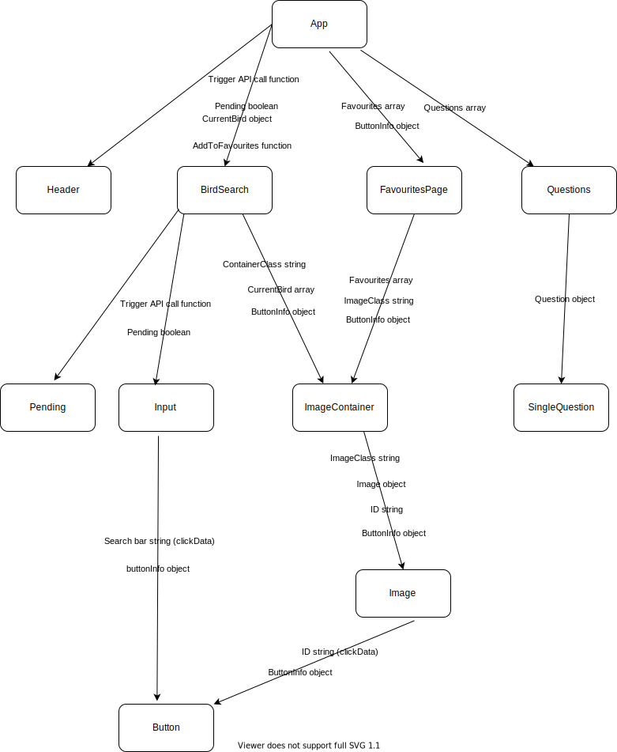

# Build-A-Bird

A web application built on React that serves computer-generated images of birds based on text submitted by the user. The user can save save their favourite images along with the text that seeded the generation.

## Table of Contents

1. [History](#history)
2. [Tools Used](#tools-used)
3. [Application Architecture](#application-architecture)
4. [API Information](#api-information)

## History

This project was initially started as a one-day hackathon with [Tommosaurus](https://github.com/Tommosaurus) whilst attending [School of Code](https://www.schoolofcode.co.uk/). Our challenge was to make a a web application using React that hooked up to an external API of our choice.

When we first found the API, we thought the submitted text was a search string and that we were accessing a database of bird images. As we were testing the API, we noticed two things:

1. The API was very slow.
2. The birds didn't really look like birds.

We finally noticed that the name of the API's creator was [OpenedAI](https://openedai.github.io/) and connected the dots. We loved the strange dreamlike images that came back, and designed our project around it. We deployed the [original version](https://buildabird.netlify.app/) on Netlify.

After the hackathon, I couldn't stop thinking about how the weird birds deserved more than one day's work. I copied our codebase here so that I could develop it further.

## Tools Used

| Category       | Link                                                                                                                                                                                                                                                                                                       |
| -------------- | ---------------------------------------------------------------------------------------------------------------------------------------------------------------------------------------------------------------------------------------------------------------------------------------------------------- |
| Tickets:       | [Trello](https://l.facebook.com/l.php?u=https%3A%2F%2Ftrello.com%2Fb%2F42rF0UPI%2Fbird-api%3Ffbclid%3DIwAR0VcyiJXSdCOFv1iwKXNn3zMopbm1bue4TJIVZbsO0IzHyaL6lc_7M2T44&h=AT221WSsdYQquMILXHAVQx5OWiEE6X2W-Q2eK8GcD4NRYZ95YGZISX7fwVHlb6g3XjihzuXXKLH6si5zkK4Mpm75myLzAkZ9yVG0ZAYCB3pHHxgAcwKW4Qq4J8raS0xbSiA) |
| Visual Design: | [Figma](https://www.figma.com/file/Dzl0skna2NEpOzQfND2trM/Bird-API?node-id=0%3A1)                                                                                                                                                                                                                          |
| Deployment:    | TBC                                                                                                                                                                                                                                                                                                        |

## Application Architecture

This is how all of the React components are structured and information is passed down through them.



## API Information

This web application uses the machine learning API [DALL-E Bird Images from Text](https://rapidapi.com/OpenedAI/api/dall-e-bird-images-from-text) made by [OpenedAI](https://openedai.github.io/).

The API takes a POST request and generates a bird image based on text submitted in the request body. The API expects the following structure for the request:

```
{
    method: 'POST',
    headers: {
        'Content-Type': 'application/json',
        'x-rapidapi-host': 'dall-e-bird-images-from-text.p.rapidapi.com',
        'x-rapidapi-key': /* Your key here */
},
    // The value of body must be a JSON object
    body: {"text": /* String to base bird image on */}
}
```
